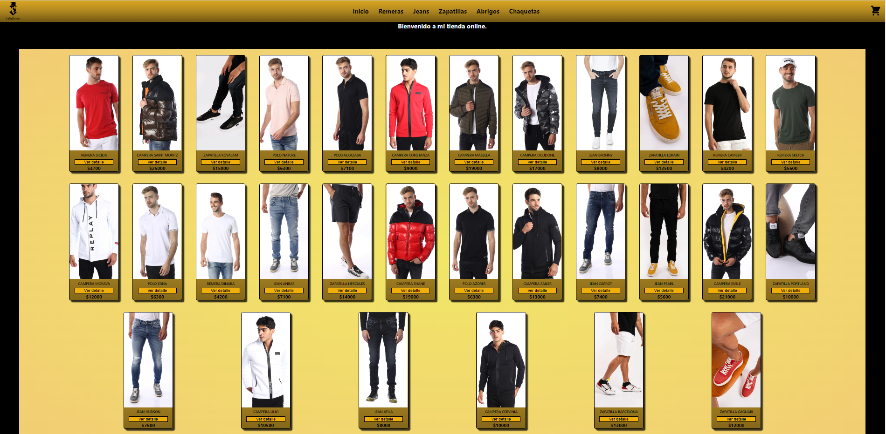
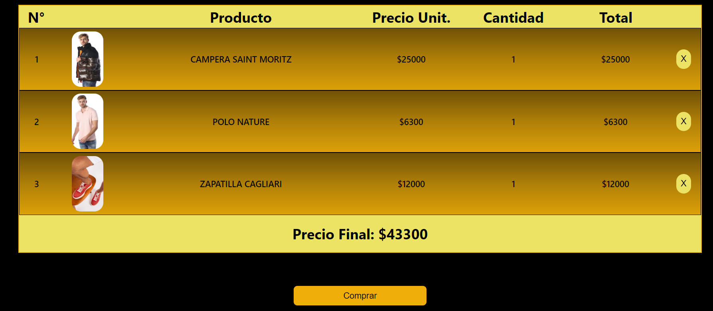
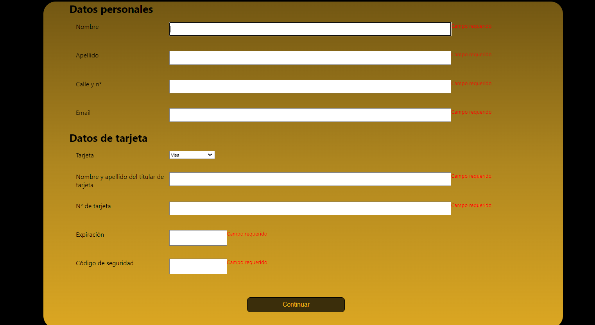

# Mi primer proyecto en React

Es un ecommerce de ropa masculina, creado con React, donde solo utilice css para dar los estilos. 

## Configurar el entorno

1. Clonar el repositorio en github
>https://github.com/MatiasGonzalez89/tienda-react.git

2. Correr en la consola el comando ```npm install```

3. Crear archivo .env. en la carpeta ```src``` del proyecto y cargar las siguientes propiedades de Firebase


REACT_APP_apiKey=
REACT_APP_authDomain=
REACT_APP_projectId=
REACT_APP_storageBucket=
REACT_APP_messagingSenderId=
REACT_APP_appId=

## Ejecutar la aplicación

Para levantar la aplicación, ejecutar el comando ```npm run start```.


>>>>>>>>>>>>>>>>>>>>__________


## Librerías utilizadas

### React-icons

> [https://react-icons.github.io/react-icons]

De esta libreria solo utilice el icono para el CartWidget.


______

### React-router-dom

>[https://github.com/remix-run/react-router]

Con React-router-dom pude hacer navegabilidad dentro del proyecto.

_____

### React-hook-form

>[https://react-hook-form.com/]

Esta librería la utilice para crear el formulario.

____


### Firebase

> [https://firebase.google.com/?hl=es]

Si bien es una plataforma digital y no una librería, la utilice como base de datos.

>>>>>>>>>>>>>>>>>>>>______

## Funcionamiento de la app

Al iniciar la aplicación se verá la vista principal con todos los productos.




En esa vista se encuentra el Navbar, desde el cual se puede filtrar los productos según su categoria. Tambien se encuentra el logo de la tienda, el cual tiene un link a la vista principal.


 El ultimo elemento del Navbar, es el icono del carrito que conduce a la vista del Cart.



Una vez que le damos click a "comprar" nos lleva a la vista del Formulario y que finalicemos la compra.




>>>>>>>>>>>>>>>>_______

## Fuente

Las imagenes de los productos las tome de un ecommerce italiano.

>[https://www.replayjeans.co.il/]

>>>>>______

Proyecto creado por Matias González para el curso de React JS de **CODER HOUSE**